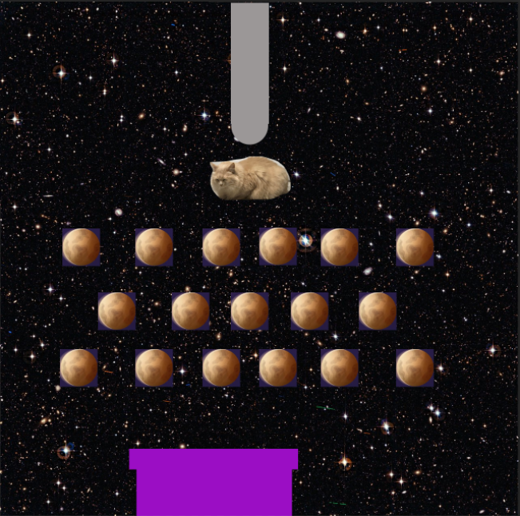

# M2_Unity.Spel-Peggle

# Week 1 reflectie

Titel: Loaf in Space

Genre: Physics-based arcade puzzelgame.

Beschrijving:
De Speler moet zo veel mogelijk punten behalen met een bewegende pijp onderaan het level.

GamePlayKern:
1. Bal: een kat (specifiek van een youtuber, AstralSpiff: Loaf)
2. Targets: kleine planeten
3. Score: Als een target geraakt is +2 punten en als in eind doelwit beland +10 punten
4. Doel:Zo veel mogelijk punten behalen

Stijl en Sfeer:
Thema is een kat in de ruimte, kleuren worden vooral galactic en geluiden: katten die miauwen

Structuur Van Level:
1. Bovenaan: 
2. Midden: 
3. Onderaan: Doelwit einde beurt.

Gemaakt door: Cady Eliana de Bruin

## week 2

hier is een kleine update van les 2.1.

